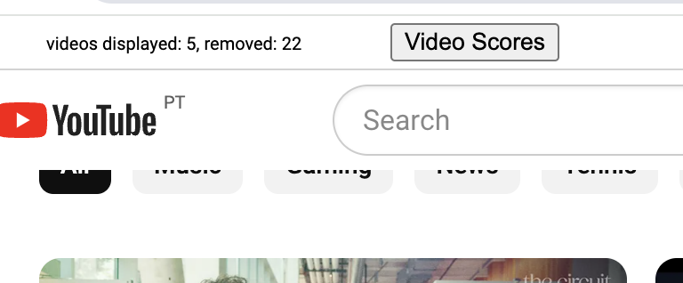
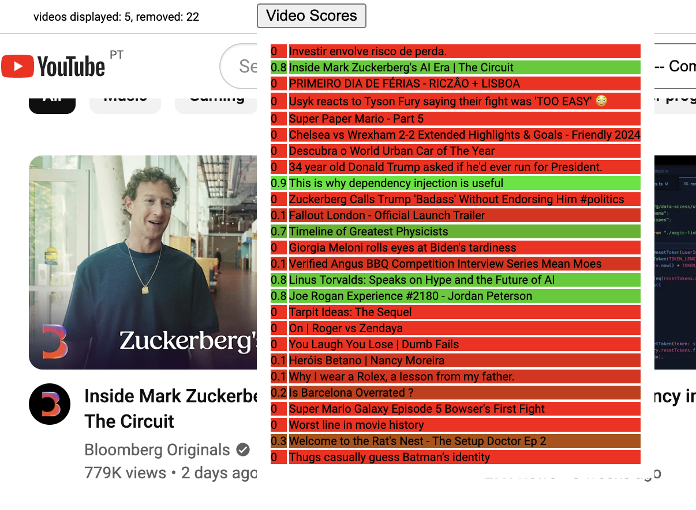
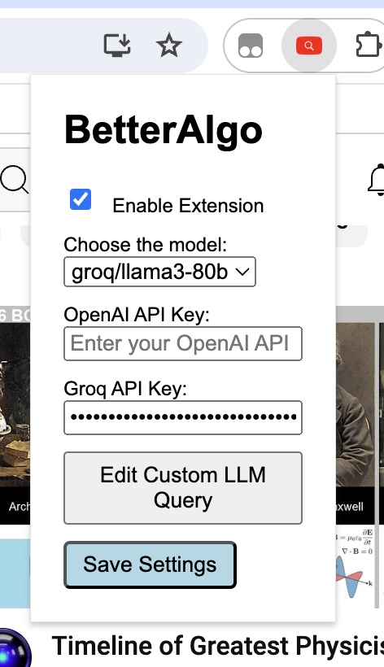
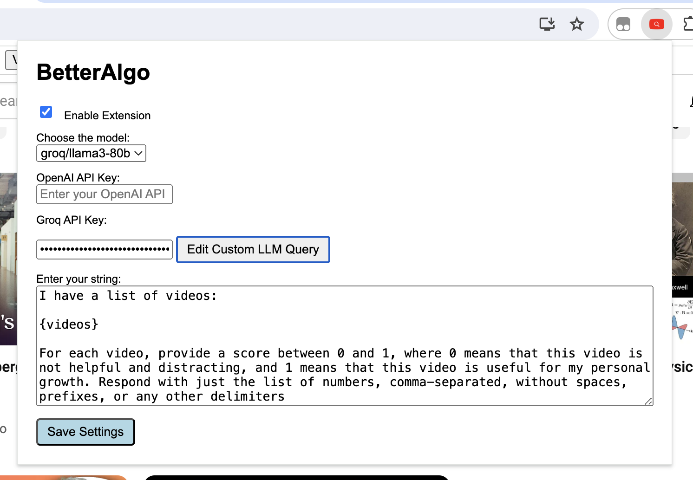

# BetterAlgo

A Chrome extension which filters out YouTube's recommended videos based on their usefulness (by default), or whatever other rule you want, using one of available LLM backends

Install by pulling the repo, then Chrome -> Manage Extensions -> Developer Mode -> Load unpacked

When installed, will filter out videos on the https://youtube.com page. At the top of the page, you'll see stats:

Video Scores button reveals scores given to each video by the LLM backend (0 is a skip, 1 is a show, threshold is 0.5):

In extension settings, you can choose the LLM backend to use:

You can edit the LLM query if you want:

